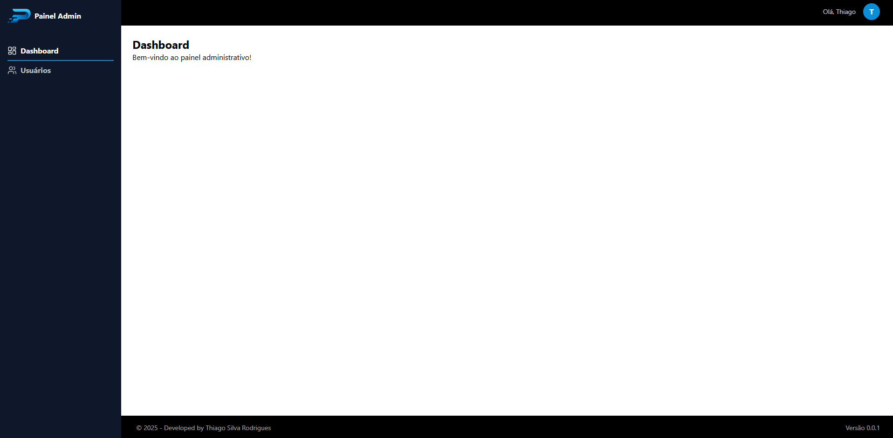
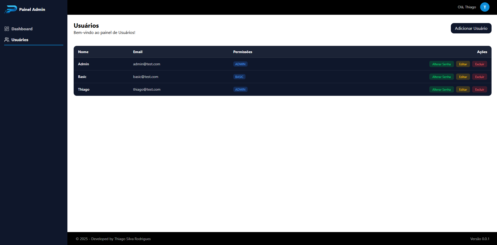
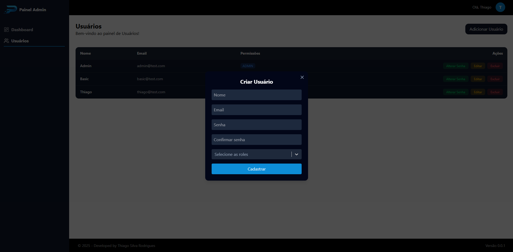
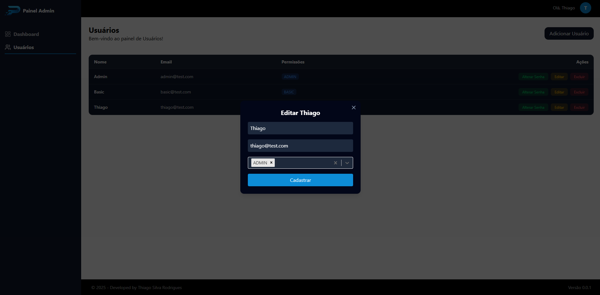
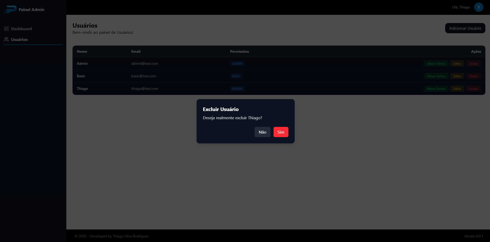
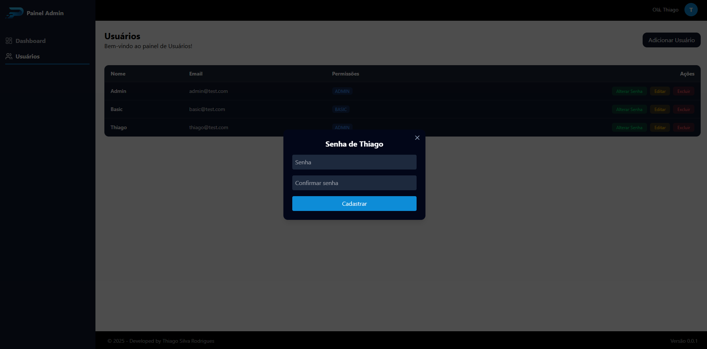

<h1>Gerenciamento de Relacionamento com Cliente</h1>

## 1. 🚀 Descrição do Projeto

O CRM Base é um sistema de gerenciamento de relacionamento com clientes desenvolvido para servir como uma fundação robusta para aplicações corporativas. Ele oferece funcionalidades essenciais de gerenciamento de usuários, permitindo criar, ler, atualizar e deletar registros de forma eficiente.

Construído com uma arquitetura moderna, o sistema é totalmente _containerizado, com uma **interface web responsiva, **API escalável_ e \*armazenamento de dados confiável\*\*, garantindo alta performance, confiabilidade e facilidade de manutenção.

O projeto foi pensado para _facilitar a expansão futura_, servindo como base para módulos adicionais de CRM, automações de vendas, e dashboards analíticos.

## 2. 🏃 Como Rodar o Projeto

Este projeto depende do _Docker_ e do _Docker Compose_ para rodar. Siga os passos abaixo para configurar e executar o projeto localmente.

### 1. Pré-requisitos

Certifique-se de ter instalados:

- [Docker](https://www.docker.com/get-started)
- [Docker Compose](https://docs.docker.com/compose/install/)
- [Git](https://git-scm.com/install)

---

### 2. Clonando o repositório

Clone o repositório do projeto para sua máquina local:

```bash
git clone https://github.com/thiagodevcodes/crm-base.git
cd crm-base
```

### 3. Chaves RSA

O projeto utiliza chaves RSA para autenticação/criptografia que será gerada automaticamente no primeiro build:

⚠️ Mantenha a chave privada segura e nunca a compartilhe publicamente.

### 4. Rodando com Docker

O projeto está configurado para rodar via Docker Compose. Execute:

```bash
docker compose up --build
```

Para baixar as imagens necessárias, criar os containers e iniciar o projeto.

### 5. Acessando o projeto

Depois que os containers estiverem rodando, você pode acessar o projeto localmente em:

http://localhost:3000

### 🛠 Tecnologias Utilizadas :

| Tecnologia         | Badge                                                                                                                                                                                        | Descrição                              |
| ------------------ | -------------------------------------------------------------------------------------------------------------------------------------------------------------------------------------------- | -------------------------------------- |
| React + NextJS     |   | Front-end moderno e responsivo         |
| Java + Spring Boot |         | Back-end robusto e escalável           |
| Hibernate          |                                                                                          | ORM do Java para persistência de dados |
| PostgreSQL         |                                                                                        | Banco de dados relacional              |
| Docker             |                                                                                                | Containerização de aplicações          |
| Docker Compose     |                                                                                        | Orquestração de múltiplos containers   |

### Fotos do Projeto








